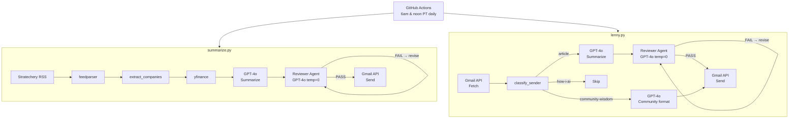

# Newsletter Summarizer

Automatically fetches, summarizes, audits, and emails daily newsletter digests using GPT-4o and the Gmail API. Runs on a GitHub Actions schedule every weekday morning.

## What it does

| Script | Newsletter | Delivery |
|---|---|---|
| `summarize.py` | Stratechery (via RSS) | Summarizes the latest paid article with financial data, market context, and implications |
| `lenny.py` | Lenny's Newsletter (via Gmail) | Summarizes paid articles and Community Wisdom emails; skips "How I AI" podcast emails |

Each summary goes through a **Reviewer Agent** that audits it against 5 editorial rules before sending. If the draft fails, it is revised and re-audited once. Summaries are then sent as formatted HTML emails to a configured recipient address.

## Architecture



## Prerequisites

- Python 3.11+
- An [OpenAI API key](https://platform.openai.com/api-keys) with GPT-4o access
- A Stratechery paid subscription (RSS feed URL)
- A Google Cloud project with the Gmail API enabled
- A Gmail account to send from (OAuth2)

## One-time setup

### 1. Install dependencies

```bash
pip install -r requirements.txt
```

### 2. Set up Gmail OAuth

1. In [Google Cloud Console](https://console.cloud.google.com/), create a project and enable the **Gmail API**
2. Create an **OAuth 2.0 Client ID** (Desktop app) and download it as `credentials.json` into this folder
3. Set the OAuth consent screen to **Production** (prevents 7-day token expiry)
4. Run the auth script — it will open a browser to authorize Gmail send + read access:

```bash
python auth.py
```

This saves a `token.json` file. Keep it secret — it contains your refresh token.

### 3. Configure GitHub Secrets

In your repo: **Settings → Secrets and variables → Actions**, add:

| Secret | Value |
|---|---|
| `OPENAI_API_KEY` | Your OpenAI API key |
| `STRATECHERY_FEED` | Your private Stratechery RSS feed URL |
| `TO_EMAIL` | Email address to deliver summaries to |
| `GMAIL_TOKEN_JSON` | Full contents of `token.json` (paste as-is) |

## Running locally

Set environment variables (PowerShell):

```powershell
$env:OPENAI_API_KEY     = "sk-proj-..."
$env:STRATECHERY_FEED   = "https://stratechery.passport.online/feed/rss/..."
$env:TO_EMAIL           = "you@gmail.com"
# token.json must exist locally from running auth.py
```

Then:

```powershell
# List recent articles in the feed
python summarize.py --list

# Summarize the latest article (default)
python summarize.py

# Summarize a specific article by index
python summarize.py --index 2

# Run the Lenny summarizer
python lenny.py

# Run the reviewer eval suite
pytest tests/test_reviewer.py -v
```

The `--index` flag bypasses the freshness check, so you can re-run on older articles for testing.

## Reviewer Agent

`src/agents/reviewer.py` audits every draft summary against 5 rules before it is sent:

| Rule | What it checks |
|---|---|
| 1 — Private financials | No specific financial figures for private companies unless sourced |
| 2 — Banned phrases | No "delve into", "the author argues", "in the ever-evolving landscape", etc. |
| 3 — List length | No single list longer than 5 items |
| 4 — POV attribution | Arguments are credited to the right person per the source article |
| 5 — Guest context | Every person introduced gets full name + title + company on first mention |

The audit loop works as follows:
1. Generate draft summary (GPT-4o)
2. Run `audit()` — returns PASS or FAIL with a critique
3. If FAIL: revise the draft using the critique, then re-audit
4. If still FAIL after revision: prefix the subject line with `⚠ Audit failed:`
5. Send email regardless

Community Wisdom emails from Lenny skip the audit — the reviewer rules don't apply to table-formatted output.

## Eval suite

`tests/test_reviewer.py` is an LLM-as-a-Judge eval suite (GPT-4o-mini) that validates the Reviewer Agent against 6 known scenarios:

| Test case | Rule tested | Expected result |
|---|---|---|
| TC-01 | Rule 1 — private financials | FAIL |
| TC-02 | Rule 2 — banned phrases | FAIL |
| TC-03 | Rule 3 — list length | FAIL |
| TC-04 | Rule 4 — POV misattribution | FAIL |
| TC-05 | Rule 5 — guest context | FAIL |
| TC-06 | Clean summary (no violations) | PASS |

Each test is scored on three binary criteria: defect catch rate, false positive rate, and critique actionability. All three must pass for the test case to pass.

```bash
pytest tests/test_reviewer.py -v
```

## Automation

The GitHub Actions workflow (`.github/workflows/summarize.yml`) runs both scripts **twice daily, every day**:

| Run | UTC | PT |
|---|---|---|
| Morning | 1pm | 6am |
| Midday | 7pm | noon |

Two runs ensure that early-morning articles (Stratechery, typically 3–5:30am PT) are caught quickly, while mid-morning articles (Lenny's, up to 10:30am PT) are caught within ~2 hours of arrival rather than the next day.

Each script skips content older than **8 hours** to prevent the midday run from re-processing articles already handled by the morning run. The workflow can also be triggered manually from the Actions tab.

## Design decisions

**Why Gmail OAuth2 instead of a dedicated reading or automation tool**
The alternatives considered:

- *Feedly / ReadWise* — reader platforms that aggregate and surface newsletter content. They do not support custom enrichment (live financials, market data) or arbitrary summarization logic, and deliver output within their own ecosystems rather than to a channel you control.
- *Zapier / Make / n8n* — automation platforms that can connect Gmail to OpenAI. They charge per task, constrain prompt logic to what their UI exposes, and cannot execute arbitrary code. Adding a step like live Yahoo Finance lookups or multi-pass auditing requires workarounds at every turn.
- *Dedicated Gmail account + SMTP/IMAP* — simpler credential model, but Google has deprecated less-secure app access and is phasing out IMAP in favour of the Gmail API. It also means managing a shadow email account solely for this pipeline.
- *Third-party sending services (Mailgun, SendGrid)* — appropriate for production apps sending at scale, but require a verified domain and additional service setup. Overkill here.

Three reasons drove the decision to build on **Gmail OAuth2** directly:

1. **Enrichment beyond the source content.** The goal was never just to reformat what the newsletter already says. Injecting live financial data, market context, and an audit pass requires full control over the pipeline — something no off-the-shelf reader or automation tool exposes.
2. **Delivery to an existing channel, without ecosystem lock-in.** Summaries land in the same inbox already used for everything else, in a format that works in any email client. There is no new app to check, no platform dependency to manage.
3. **No shadow account.** A single OAuth token on the primary Gmail account covers both reading (fetching Lenny emails) and sending (delivering summaries). No separate account to create, monitor, or maintain.

**RSS for Stratechery, Gmail API for Lenny's**
Stratechery provides a private paid RSS feed, so fetching it is a simple URL call — no inbox access needed. Lenny's Newsletter doesn't have an equivalent paid feed, so I read it directly from Gmail using the Gmail API with `gmail.readonly` scope.

**LLM-based reviewer instead of deterministic checks**
Rules 1, 4, and 5 require semantic reasoning — understanding whether a company is public or private, whether an argument is correctly attributed, whether a person has been properly introduced. These can't be reliably handled with regex. Rules 2 and 3 (banned phrases and list length) are technically deterministic, but keeping all 5 rules in a single LLM call simplifies the pipeline and makes the critique more coherent. The trade-off is token cost and the small risk of the reviewer hallucinating a false positive.

**Time-based deduplication instead of a database**
The simplest way to avoid re-sending an article is to check whether it was published within the last 8 hours. With two runs per day 6 hours apart, an 8-hour window ensures each article is processed by exactly one run, with a small 2-hour overlap buffer for GitHub Actions scheduling delays. This is stateless, requires no persistence layer, and works naturally with ephemeral CI runners. A database or state file would add complexity with no real benefit at this scale.

**Standalone scripts instead of a shared module**
`lenny.py` duplicates some utilities from `summarize.py` (HTML stripping, Gmail service setup, email sending) rather than importing them. Keeping the scripts self-contained avoids a fragile import dependency and makes each script independently runnable. The `sys.stdout` encoding wrapper is scoped to `if __name__ == '__main__'` in both scripts so they can be safely imported in tests without disrupting pytest's output capture.

**Two-step pipeline for Stratechery financials**
Rather than asking GPT to recall financial figures from training data (which would be stale or hallucinated), I run a lightweight extraction pass first to identify ticker symbols, fetch live data from Yahoo Finance, and inject it into the summarization prompt. This keeps the financials grounded in real numbers.

**Classify Lenny emails by sender address, not subject**
Lenny sends three distinct email types from three distinct substack addresses (`lenny@`, `lenny+community-wisdom@`, `lenny+how-i-ai@`). Routing on sender address is more reliable than parsing subject lines, which can vary in format.

**GitHub Actions for scheduling**
Free, requires no server or cloud infrastructure, and integrates naturally with the existing repo. The main trade-off is that scheduled runs can be delayed by a few minutes under load — the 8-hour freshness window (vs. 6-hour run gap) provides a 2-hour buffer to account for this.

## File structure

```
summarize.py          # Stratechery summarizer
lenny.py              # Lenny's Newsletter summarizer
auth.py               # One-time OAuth setup script
requirements.txt      # Python dependencies
credentials.json      # Google OAuth client config (not committed)
token.json            # Gmail refresh token (not committed)
src/
  agents/
    reviewer.py       # Reviewer Agent — audits drafts against 5 rules
tests/
  test_reviewer.py    # LLM-as-a-Judge eval suite (6 test cases)
  test_freshness.py   # Unit tests for is_fresh() freshness logic
  conftest.py         # Pytest fixtures
  fixtures/
    eval_dataset.json # Eval scenarios (TC-01 through TC-06)
    mock_article.txt  # Sample article for eval tests
    mock_finance.json # Sample yfinance data for eval tests
.github/
  workflows/
    summarize.yml     # GitHub Actions workflow
```
